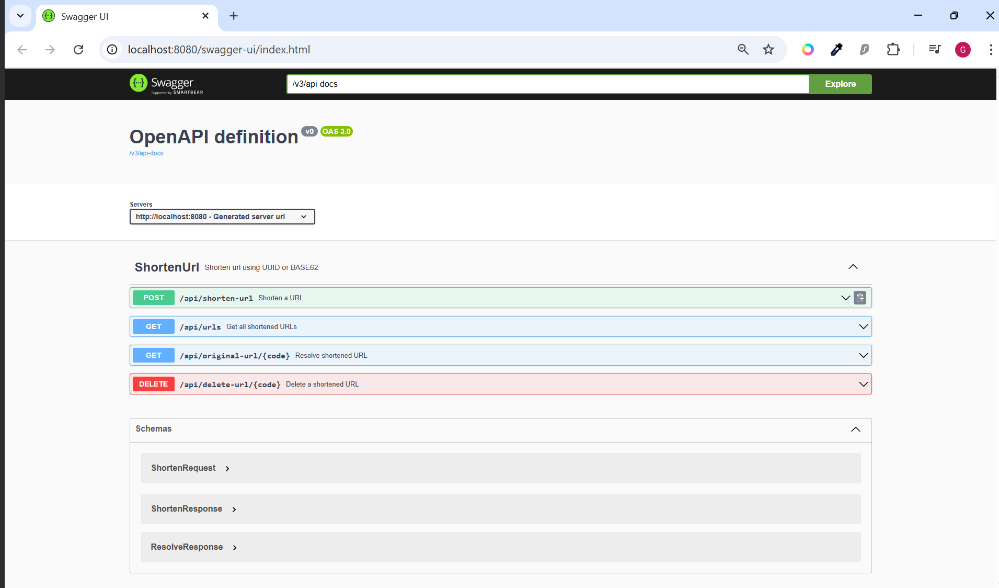
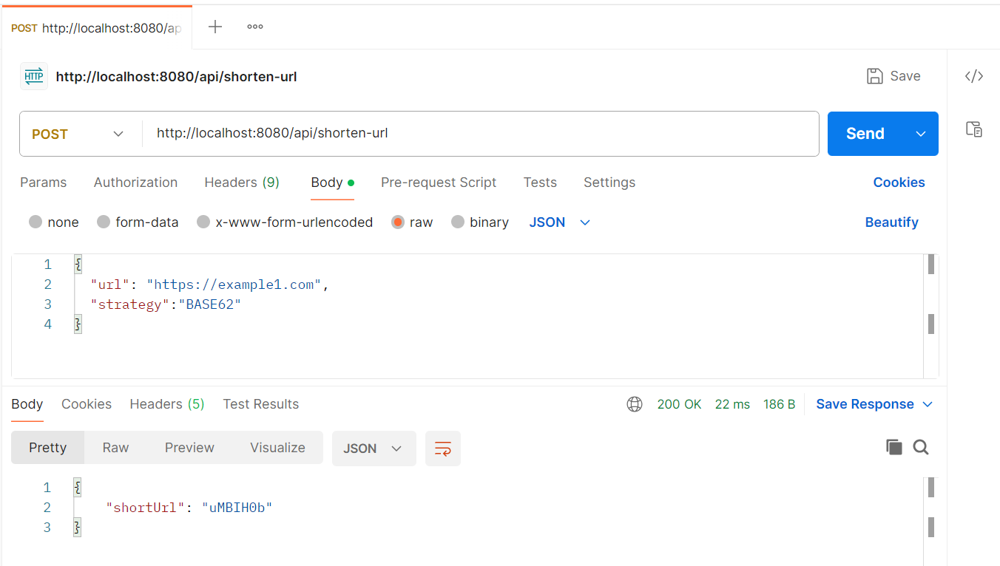
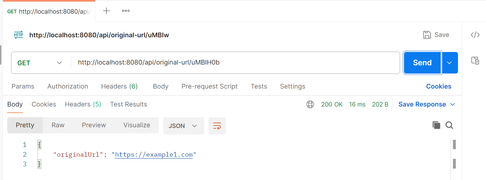
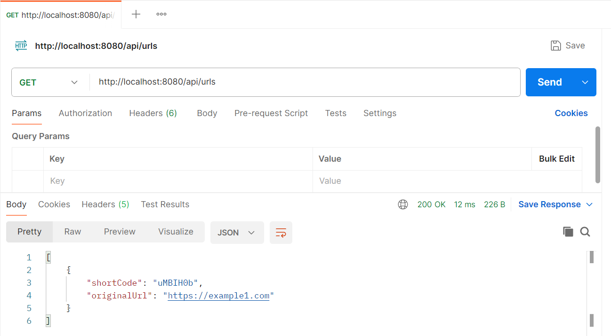
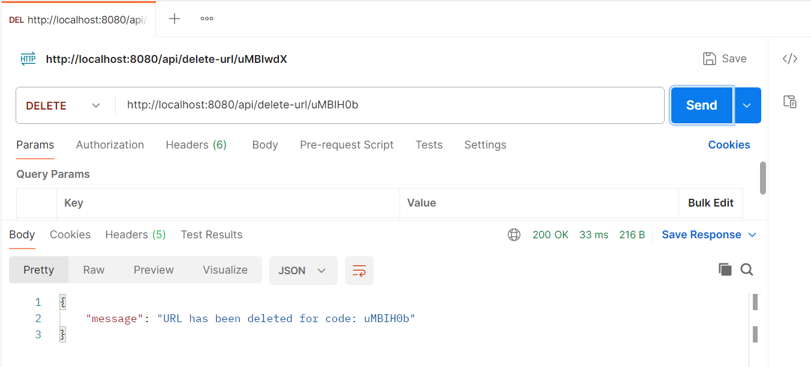

# URL Shortener Project (Kotlin + Spring Boot)

A URL shortener is a service that takes a long URL and generates a shorter, unique alias (short code) using strategies such as UUID or BASE62, that redirects users to the original URL when accessed
and a backend built using Kotlin, Spring Boot, PostgreSQL, and Gradle.

---

## Features

- Shorten any URL with unique codes
- Store and retrieve original URLs using a short code
- Delete original URL by using a short code
- Get all original URLs with associated short codes and strategies
- Shorten url using UUID or BASE62
- PostgreSQL database for persistent storage
- RESTful API with OpenAPI documentation

---

## Tech Stack

- **Language:** Kotlin (JVM 17)
- **Framework:** Spring Boot 3.2
- **Database:** PostgreSQL
- **Build Tool:** Gradle Kotlin
- **API Docs:** Springdoc OpenAPI

---

## Development Environment

This project was developed using **IntelliJ IDEA**, which is highly recommended for Kotlin development.

- IntelliJ provides first-class support for Kotlin and Spring Boot
- Includes built-in Kotlin compiler, and Spring-aware navigation

You can open this project directly as a Gradle project in IntelliJ and run it with minimal setup.

---

## Project Structure

```text
src/
 └── main/
      ├── kotlin/       # Kotlin source code
      ├── resources/
           ├── application.properties
init.sql                # SQL schema for DB
.env.example            # PostgreSQL credentials
setup.bat               # Windows setup script
README.md               # Project guide
```

---

## Setup Instructions

### Prerequisites

- Java 17
- PostgreSQL installed and running locally
- `psql` command-line tool in PATH
- Gradle Wrapper (included)
---

### Windows
> **Note:** Running `./setup.bat` is mandatory before starting the application.
> It ensures that the PostgreSQL database is created and initialized with the required schema. PostgreSQL must be installed and running, as it is used to store both the original and shortened URLs.

```bat
git clone https://github.com/gnikamm/URL_Shortner.git
cd URL_Shortner
copy .env.example .env
./setup.bat
```

### Or use Gradle Task
```bash
./gradlew initDb
```

---

## Environment Config (.env)

```env
DB_HOST=localhost
DB_PORT=5432
DB_NAME=urlshort_db
DB_USER=your_user
DB_PASS=your_password
```

---

## API Documentation (Swagger UI)

OpenAPI is integrated using Springdoc. You can explore and test the API visually:

🔗 [Swagger UI](http://localhost:8080/swagger-ui/index.html)

This interactive interface allows developers to:
- View all available endpoints
- Try out API requests directly from the browser
- Understand request/response structures



---

## API Testing

### POST /api/shorten-url
```bash
curl -X POST http://localhost:8080/api/shorten-url \
     -H "Content-Type: application/json" \
     -d '{"url": "https://openai.com"}'
```


### GET /api/original-url/{shortCode}
```bash
curl http://localhost:8080/api/original-url/uMwibG1
```



---

### GET /api/urls
```bash
curl http://localhost:8080/api/urls
```



---

### DELETE /api/urls
```bash
curl http://localhost:8080/api/delete-url/uMwibG1
```



---

## Example Table Schema

```sql
CREATE TABLE short_url (
    url_nr SERIAL PRIMARY KEY,
    short_code VARCHAR(255) UNIQUE NOT NULL,
    original_url TEXT UNIQUE NOT NULL,
    strategy VARCHAR(255) NOT NULL
);
```
---

## License

This project is free to use.